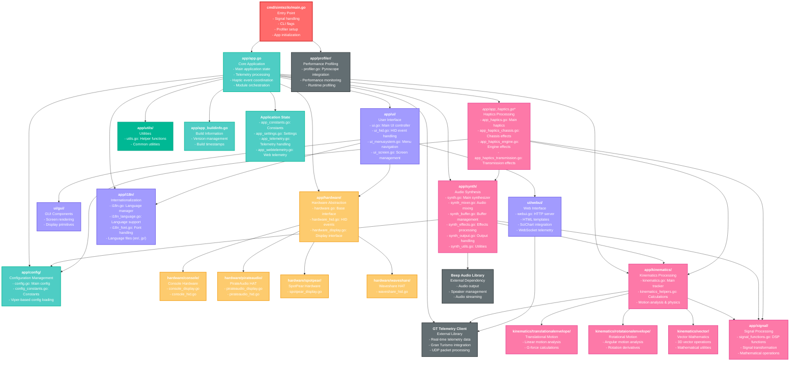

```mermaid
graph TD
    %% Entry Point
    Main["`**cmd/simtezilo/main.go**
    Entry Point
    - Signal handling
    - CLI flags
    - Profiler setup
    - App initialization`"]

    %% Core App Module
    App["`**app/app.go**
    Core Application
    - Main application state
    - Telemetry processing
    - Haptic event coordination
    - Module orchestration`"]

    %% Configuration
    Config["`**app/config/**
    Configuration Management
    - config.go: Main config
    - config_constants.go: Constants
    - Viper-based config loading`"]

    %% Hardware Layer
    Hardware["`**app/hardware/**
    Hardware Abstraction
    - hardware.go: Base interface
    - hardware_hid.go: HID events
    - hardware_display.go: Display interface`"]
    
    HW_Console["`**hardware/console/**
    Console Hardware
    - console_display.go
    - console_hid.go`"]
    
    HW_PirateAudio["`**hardware/pirateaudio/**
    PirateAudio HAT
    - pirateaudio_display.go
    - pirateaudio_hid.go`"]
    
    HW_SpotPear["`**hardware/spotpear/**
    SpotPear Hardware
    - spotpear_display.go`"]
    
    HW_Waveshare["`**hardware/waveshare/**
    Waveshare HAT
    - waveshare_hid.go`"]

    %% UI Layer
    UI["`**app/ui/**
    User Interface
    - ui.go: Main UI controller
    - ui_hid.go: HID event handling
    - ui_menusystem.go: Menu navigation
    - ui_screen.go: Screen management`"]
    
    GUI["`**ui/gui/**
    GUI Components
    - Screen rendering
    - Display primitives`"]
    
    WebUI["`**ui/webui/**
    Web Interface
    - webui.go: HTTP server
    - HTML templates
    - SciChart integration
    - WebSocket telemetry`"]

    %% Internationalization
    I18N["`**app/i18n/**
    Internationalization
    - i18n.go: Language manager
    - i18n_language.go: Language support
    - i18n_font.go: Font handling
    - Language files (en/, jp/)`"]

    %% Kinematics Engine
    Kinematics["`**app/kinematics/**
    Kinematics Processing
    - kinematics.go: Main tracker
    - kinematics_helpers.go: Calculations
    - Motion analysis & physics`"]
    
    KIN_Translation["`**kinematics/translationalenvelope/**
    Translational Motion
    - Linear motion analysis
    - G-force calculations`"]
    
    KIN_Rotation["`**kinematics/rotataionalenvelope/**
    Rotational Motion
    - Angular motion analysis
    - Rotation derivatives`"]
    
    KIN_Vector["`**kinematics/vector/**
    Vector Mathematics
    - 3D vector operations
    - Mathematical utilities`"]

    %% Audio Synthesis
    Synth["`**app/synth/**
    Audio Synthesis
    - synth.go: Main synthesizer
    - synth_mixer.go: Audio mixing
    - synth_buffer.go: Buffer management
    - synth_effects.go: Effects processing
    - synth_output.go: Output handling
    - synth_utils.go: Utilities`"]

    %% Signal Processing
    Signal["`**app/signal/**
    Signal Processing
    - signal_functions.go: DSP functions
    - Signal transformation
    - Mathematical operations`"]

    %% Telemetry Client
    TelemetryClient["`**GT Telemetry Client**
    External Library
    - Real-time telemetry data
    - Gran Turismo integration
    - UDP packet processing`"]

    %% Profiler
    Profiler["`**app/profiler/**
    Performance Profiling
    - profiler.go: Pyroscope integration
    - Performance monitoring
    - Runtime profiling`"]

    %% Haptics
    Haptics["`**app/app_haptics*.go**
    Haptics Processing
    - app_haptics.go: Main haptics
    - app_haptics_chassis.go: Chassis effects
    - app_haptics_engine.go: Engine effects
    - app_haptics_transmission.go: Transmission effects`"]

    %% Utilities
    Utils["`**app/utils/**
    Utilities
    - utils.go: Helper functions
    - Common utilities`"]

    %% External Audio Library
    AudioLib["`**Beep Audio Library**
    External Dependency
    - Audio output
    - Speaker management
    - Audio streaming`"]

    %% Build Info
    BuildInfo["`**app/app_buildinfo.go**
    Build Information
    - Version management
    - Build timestamps`"]

    %% Application State
    AppState["`**Application State**
    - app_constants.go: Constants
    - app_settings.go: Settings
    - app_telemetry.go: Telemetry handling
    - app_webtelemetry.go: Web telemetry`"]

    %% Connections
    Main --> App
    Main --> Profiler
    
    App --> Config
    App --> Hardware
    App --> UI
    App --> I18N
    App --> Kinematics
    App --> Synth
    App --> TelemetryClient
    App --> Haptics
    App --> AppState
    App --> BuildInfo
    
    Hardware --> HW_Console
    Hardware --> HW_PirateAudio
    Hardware --> HW_SpotPear
    Hardware --> HW_Waveshare
    
    UI --> GUI
    UI --> WebUI
    UI --> Hardware
    UI --> I18N
    
    Kinematics --> KIN_Translation
    Kinematics --> KIN_Rotation
    Kinematics --> KIN_Vector
    Kinematics --> Signal
    Kinematics --> TelemetryClient
    
    Synth --> Signal
    Synth --> Kinematics
    Synth --> Config
    Synth --> AudioLib
    
    Haptics --> Kinematics
    Haptics --> Synth
    Haptics --> Config
    Haptics --> Signal
    
    WebUI --> TelemetryClient
    
    App --> Utils

    %% Styling
    classDef entryPoint fill:#ff6b6b,stroke:#d63031,stroke-width:3px,color:#fff
    classDef coreModule fill:#4ecdc4,stroke:#00b894,stroke-width:2px,color:#fff
    classDef hardwareModule fill:#fdcb6e,stroke:#f39c12,stroke-width:2px,color:#fff
    classDef uiModule fill:#a29bfe,stroke:#6c5ce7,stroke-width:2px,color:#fff
    classDef processingModule fill:#fd79a8,stroke:#e84393,stroke-width:2px,color:#fff
    classDef externalLib fill:#636e72,stroke:#2d3436,stroke-width:2px,color:#fff
    classDef utilityModule fill:#00b894,stroke:#00a085,stroke-width:2px,color:#fff

    class Main entryPoint
    class App,Config,AppState,BuildInfo coreModule
    class Hardware,HW_Console,HW_PirateAudio,HW_SpotPear,HW_Waveshare hardwareModule
    class UI,GUI,WebUI,I18N uiModule
    class Kinematics,KIN_Translation,KIN_Rotation,KIN_Vector,Synth,Signal,Haptics processingModule
    class TelemetryClient,AudioLib,Profiler externalLib
    class Utils utilityModule
```