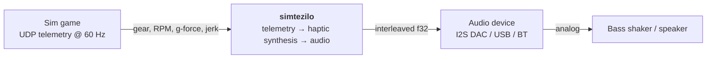
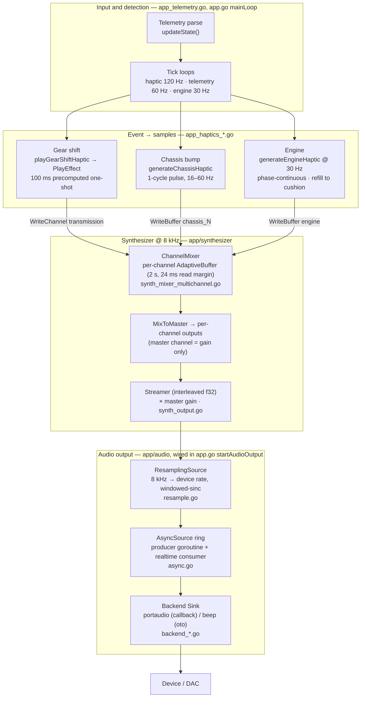
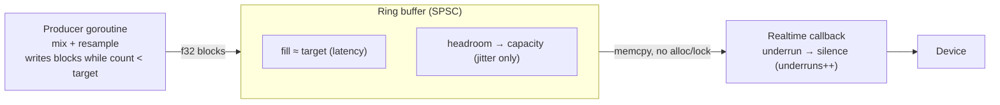
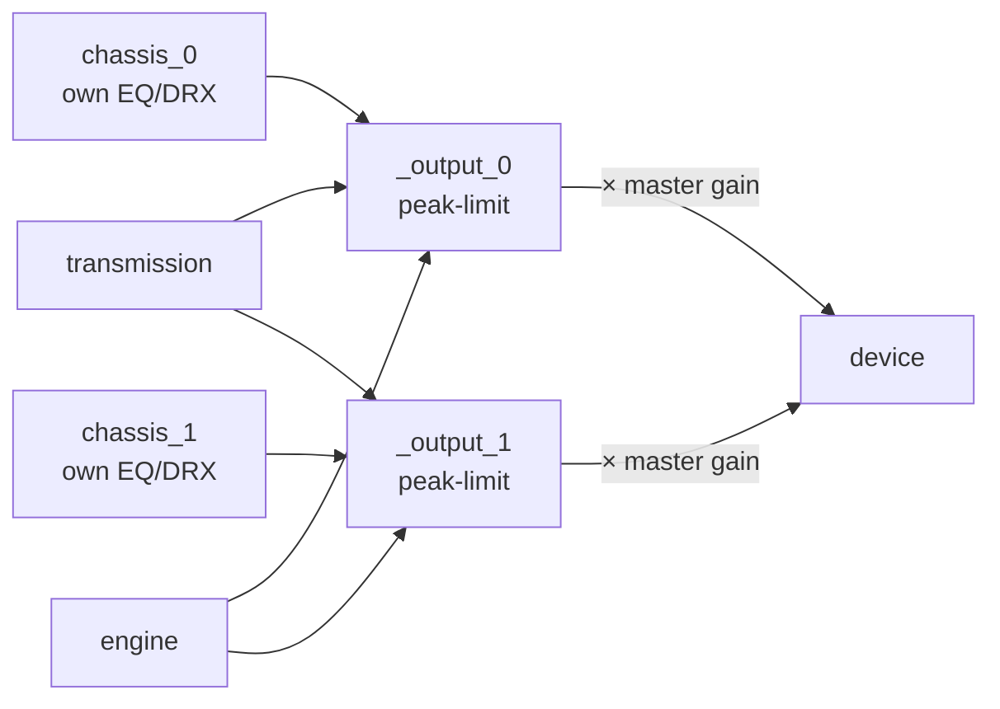
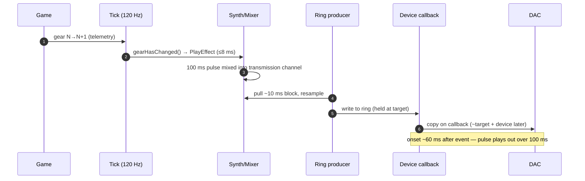

# Audio Pipeline

## 1. Haptic event types & buffering strategy

The sim emits telemetry at 60 Hz. Three haptic event types exist, each with a
**deliberately different** buffering strategy. The governing distinction: a
waveform that returns to **zero amplitude** is self-contained and needs only
additive mixing; a waveform that ends at an **arbitrary amplitude** must carry
its phase into the next frame.

| Type | Generation | Buffer write | Phase carry |
|---|---|---|---|
| Gear | ~100 ms precomputed one-shot sample | `playGearShiftHaptic` → `PlayEffect` (`transmission`) | none |
| Chassis | per-frame self-terminating half-wave pulse `(amp·sin + amp)/2`, 16–60 Hz | `WriteBuffer(…, overwrite=false)` → mix mode | none (ends at 0) |
| Engine | continuous waveform from RPM/engine type @ 30 Hz | `OverwriteBuffer` at the write cursor (append) | accumulated fractional phase (`pulsePhase`) |

**Self-contained vs. continuous.** Gear and chassis pulses both start and end at
zero, so successive frames just sum: chassis writes land in [`writeMixMode`](../app/synthesizer/synth_buffer_adaptive.go),
adding overlapping pulses additively with no carried state, and the gear one-shot
is fired and forgotten. The engine waveform can end at any amplitude, so the next
frame must continue from the exact phase the last one stopped at. A persistent
[`engineWaveformGenerator`](../app/app_haptics_engine_generator.go) holds the
accumulated fractional phase (`pulsePhase`) to do this — which is why the old
zero-crossing **stitch** and alternating-polarity logic could be removed.

**Two stacked cushions (engine path).** The engine has two independent cushions
in series. The **channel cushion** — [`engineCushionFrames = 3`](../app/app_haptics_engine.go)
(~50 ms) — absorbs (a) telemetry-feed jitter and (b) the *reactive refill*: each
30 Hz tick regenerates only the samples drained since the last tick
(`engineRefillSamples`, read via `ChannelDepth`) and tops the channel back up to
the cushion, so the depth is bounded without a depth cap, and the slack keeps the
channel from starving if a generation tick runs late or is skipped. Downstream,
the **async device ring** (`target` = one device period) is a separate cushion on
a different clock — it isolates audio-callback jitter, not telemetry jitter.

## Flow

How a haptic input event becomes sound, from a telemetry packet to the DAC.
Diagrams follow the C4 model (Context → Component) with focused sub-visuals for
the latency-critical stages.

Two independent output streams exist; this document covers the **haptics** path.
Pit-radio (voice, 48 kHz) is a separate sink and is out of scope.

---

### 1. Context (C4 L1)

---

### 2. Component view (C4 L2) — the haptic audio pipeline

Synthesis runs at an **8 kHz** internal rate; output is resampled to the device's
**native rate** (e.g. 44.1/48 kHz). The realtime device callback only copies
samples — all heavy work happens on the producer goroutine.

**Stage reference**

| Stage | File | Rate | Role |
|---|---|---|---|
| Detection | `app_telemetry.go`, `app.go` | 60–120 Hz | poll telemetry, detect events |
| Event synth | `app_haptics_*.go`, `synth_effects.go` | 8 kHz | event → waveform into a channel |
| Mixer | `synth_mixer_multichannel.go`, `synth_buffer_adaptive.go` | 8 kHz | per-channel buffers → output channels |
| Streamer | `synth_output.go` | 8 kHz | mix-on-demand, × master gain, interleaved f32 |
| Resampler | `resample.go` | 8 k→dev | band-limited up-sample |
| Async ring | `async.go` | dev | decouple synthesis from callback |
| Sink | `backend_portaudio.go` / `backend_beep.go` | dev | realtime device output |

---

### 3. Latency budget

End-to-end is dominated by two serial buffers — the **ring** and the **device** —
each ≈ the configured `latencyMs`. Measured on an I2S DAC at 44.1 kHz, 30 ms:

| Contributor | Depth | Notes |
|---|---|---|
| Event detection | ≤ 8.3 ms | one 120 Hz haptic tick |
| Mixer channel | ~0 ms | event lands at the read cursor (idle channel) |
| Resampler | ~1–2 ms | only filter-tap look-ahead (`kernelHalfWidth`) |
| **Async ring** | **= 1 period (~30 ms)** | producer holds a *target* level (high-water mark), not at capacity |
| **Device buffer** | **= negotiated (~30 ms)** | portaudio honors the hint on this DAC |
| **Total event→DAC** | **~60 ms (~4 telemetry frames)** | was ~130 ms at the old 66 ms setting |

Sizing (`hapticBufferFrames`, `app.go`): `period = rate·latencyMs/1000`,
`target = max(period, block)`, `capacity = max(2·period, 4·block)`,
`block ≈ 10 ms`. **Lower `latencyMs` to reduce latency** (shrinks ring + device
together); validate `asyncUnderruns == 0` under load.

---

### 4. Sub-visual — AsyncSource ring (latency-critical)

The ring decouples heavy synthesis from the realtime callback. The producer fills
only to `target` (the latency); `capacity` above it is jitter headroom that never
becomes steady-state latency. The callback never blocks — it pads with silence on
underrun (counted as `underruns`).

- **Steady state:** `count ≈ target`; producer waits when `count ≥ target`.
- **Burst/GC:** consumer drains into headroom; producer catches back up to target.
- **Pre-fill:** `target` frames of silence at start (callback never starves; synth
  isn't pulled until the silence drains, so upstream buffers aren't emptied early).

---

### 5. Sub-visual — Multichannel mixer

Per-channel **EQ and DRX are applied upstream, at generation** (chassis pulses in
`app_haptics_chassis.go`), baked into each source channel before it reaches the
mixer. `MixToMaster` then routes **per channel** — `chassis_N → output_N` — while
`transmission` and `engine` mix into every output; each output is peak-limited.
The device is fed from the **output channels** (the `Streamer` applies the master
*gain* to them). (Calibration mode replaces this mix.)

Writes are **additive** (mix-mode in code) and never dropped. A channel buffer
is 2 s deep at 8 kHz; the longest pulse (16 Hz chassis cycle, 62.5 ms) uses ~3 %.

#### Overlap mixing & peak handling

A new pulse is generated every haptic frame, so a short, high-frequency pulse is
routinely written on top of a longer, lower-frequency pulse that is still
playing. The combine of the new write with existing buffer content must satisfy
two constraints at once: stay within ±1.0 (no clipping), and introduce **no
amplitude step** into waveforms already in flight (a step is an audible
pop/click).

**The pitfall (fixed).** A naive approach summed the overlap and then, if the sum
exceeded unity, divided *only the just-written window* by the peak. Because the
existing long pulse extends far past that window, scaling just the window left a
gain step at both ends of the new pulse — and at the read cursor, against
samples already emitted — i.e. an audible click exactly where a long wave is
"interrupted" by a shorter one. Additive mixing of two self-terminating pulses is
inherently click-free; the retroactive window-local limiter was what injected the
clicks.

**The combine (priority/ducking mix).** Each sample is mixed with
[`mixSamplePriority`](../app/synthesizer/synth_utils.go): of the two overlapping
samples, the **louder** (larger magnitude) is the *dominant* and keeps its full
amplitude; the **weaker** is the *subordinate* and is ducked into whatever
headroom remains below unity (`1 − |dominant|`). The result is bounded to ±1.0 by
construction, so **no separate peak-limiting pass is needed** on the channel
buffer. This deliberately favours dynamics: a high-energy event gains prevalence
over weaker overlapping waveforms instead of both being attenuated equally by a
global limiter.

It is click-free because the ducking amount is magnitude-driven: where either
pulse is near zero (every self-terminating pulse's own edges) the ducking tapers
to zero, so the underlying wave is left untouched at the write boundaries — no
step. The combine lives in [`writeMixMode` /
`mixSampleAtIndex`](../app/synthesizer/synth_buffer_adaptive.go); the engine
path's headroom ducking (`processEngineSamplesMulti`) is the same idea but with a
*fixed* priority (engine always subordinate), kept separate on purpose.

Regression guards (`synth_priority_mix_test.go`) scan a realistic multi-pulse
stream and fail if any sample exceeds ±1.0 or any sample-to-sample step exceeds
the constituent waveforms' legitimate slope.

---

### 6. Sub-visual — Gear-change timeline

---

### 7. Glossary

Maps the terms above to standard audio/DSP vocabulary and the code symbol.

| Term (this doc) | Standard term | Meaning · code symbol |
|---|---|---|
| target level | set-point / high-water mark | occupancy the producer maintains, below capacity · `target` |
| capacity | buffer capacity | max ring depth; the slack above the target is jitter headroom · `capacity` |
| underrun | underrun / xrun | ring ran dry, so the callback emits silence · `underruns` |
| period | device period | frames per device callback (derived from `latencyMs`) |
| block | block / chunk | producer's per-iteration work unit, ~10 ms · `blockFrames` |
| tap | FIR tap | one filter coefficient; kernel half-width = `kernelHalfWidth` |
| one-shot | one-shot sample | precomputed fixed waveform (the gear-shift pulse) |
| additive write | mix | sum into a channel buffer (vs. overwrite) · "mix-mode" |
| priority/ducking mix | side-chain ducking | overlap combine where the louder sample keeps full amplitude and the weaker is ducked into the remaining headroom; bounds output to ±1.0 without a limiter · `mixSamplePriority` |
| read margin | pre-roll | silence/slack so a late writer can't cause a short read · `cushion` |

Project-specific terms (kept deliberately):

| Term | Meaning |
|---|---|
| **DRX** | *Dynamic Range eXpansion* — retune a pulse to a resonant EQ bucket to exploit the transducer's mechanical resonance (`app/signal/signal.go`). |
| **stitch** | *(removed)* the former engine approach spliced successive waveform segments at a zero crossing to avoid clicks; superseded by the phase-continuous generator (`app_haptics_engine_generator.go`), which carries `pulsePhase` across frames so segments join seamlessly. |
| **cushion** | the engine channel's target unread depth (`engineCushionFrames`), refilled each tick to bound latency while absorbing jitter (`app_haptics_engine.go`). |
| **AdaptiveBuffer** | per-channel ring with a read margin and over/under-flow tracking (`synth_buffer_adaptive.go`). |
| **jerk / snap** | standard physics — 3rd / 4th time-derivatives of position (drive chassis pulse shape). |
