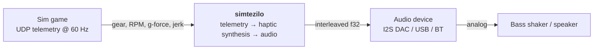
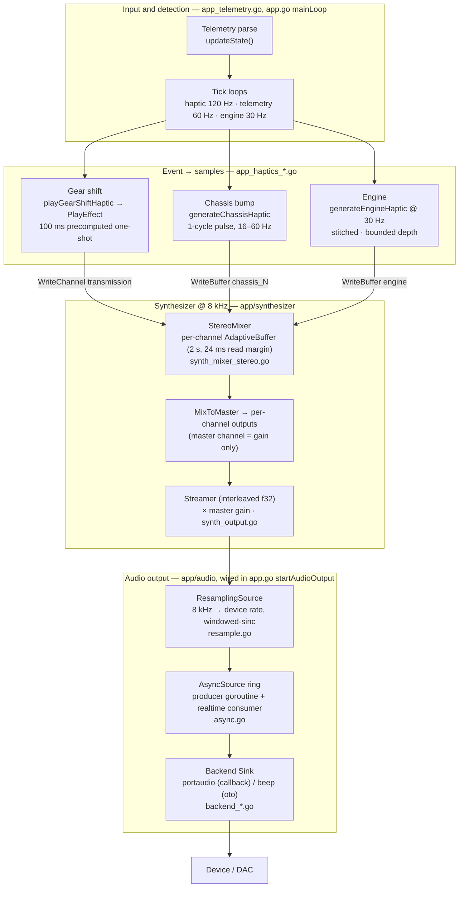
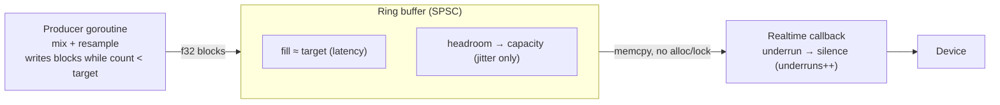
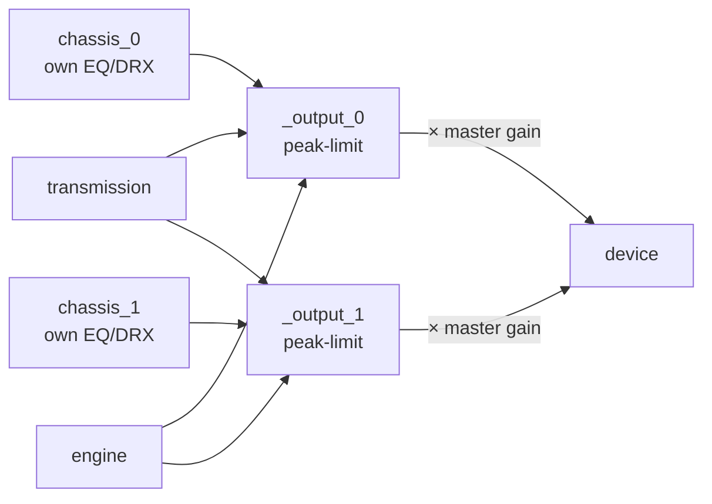
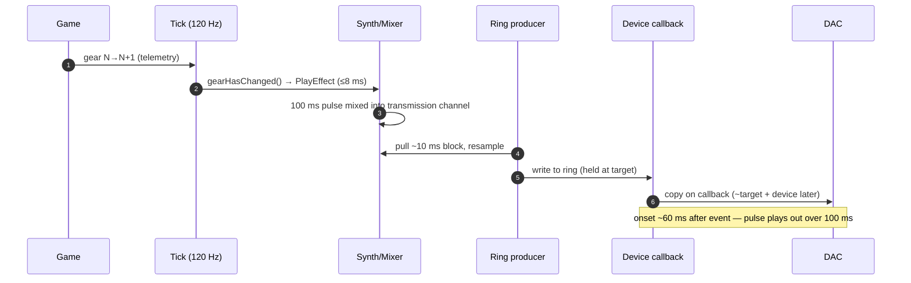

# Audio Pipeline

How a haptic input event becomes sound, from a telemetry packet to the DAC.
Diagrams follow the C4 model (Context → Component) with focused sub-visuals for
the latency-critical stages.

Two independent output streams exist; this document covers the **haptics** path.
Pit-radio (voice, 48 kHz) is a separate sink and is out of scope.

---

## 1. Context (C4 L1)

---

## 2. Component view (C4 L2) — the haptic audio pipeline

Synthesis runs at an **8 kHz** internal rate; output is resampled to the device's
**native rate** (e.g. 44.1/48 kHz). The realtime device callback only copies
samples — all heavy work happens on the producer goroutine.

**Stage reference**

| Stage | File | Rate | Role |
|---|---|---|---|
| Detection | `app_telemetry.go`, `app.go` | 60–120 Hz | poll telemetry, detect events |
| Event synth | `app_haptics_*.go`, `synth_effects.go` | 8 kHz | event → waveform into a channel |
| Mixer | `synth_mixer_stereo.go`, `synth_buffer_adaptive.go` | 8 kHz | per-channel buffers → output channels |
| Streamer | `synth_output.go` | 8 kHz | mix-on-demand, × master gain, interleaved f32 |
| Resampler | `resample.go` | 8 k→dev | band-limited up-sample |
| Async ring | `async.go` | dev | decouple synthesis from callback |
| Sink | `backend_portaudio.go` / `backend_beep.go` | dev | realtime device output |

---

## 3. Latency budget

End-to-end is dominated by two serial buffers — the **ring** and the **device** —
each ≈ the configured `latencyMs`. Measured on an I2S DAC at 44.1 kHz, 30 ms:

| Contributor | Depth | Notes |
|---|---|---|
| Event detection | ≤ 8.3 ms | one 120 Hz haptic tick |
| Mixer channel | ~0 ms | event lands at the read cursor (idle channel) |
| Resampler | ~1–2 ms | only filter-tap look-ahead (`kernelHalfWidth`) |
| **Async ring** | **= 1 period (~30 ms)** | producer holds a *target* level (high-water mark), not at capacity |
| **Device buffer** | **= negotiated (~30 ms)** | portaudio honors the hint on this DAC |
| **Total event→DAC** | **~60 ms (~4 telemetry frames)** | was ~130 ms at the old 66 ms setting |

Sizing (`hapticBufferFrames`, `app.go`): `period = rate·latencyMs/1000`,
`target = max(period, block)`, `capacity = max(2·period, 4·block)`,
`block ≈ 10 ms`. **Lower `latencyMs` to reduce latency** (shrinks ring + device
together); validate `asyncUnderruns == 0` under load.

---

## 4. Sub-visual — AsyncSource ring (latency-critical)

The ring decouples heavy synthesis from the realtime callback. The producer fills
only to `target` (the latency); `capacity` above it is jitter headroom that never
becomes steady-state latency. The callback never blocks — it pads with silence on
underrun (counted as `underruns`).

- **Steady state:** `count ≈ target`; producer waits when `count ≥ target`.
- **Burst/GC:** consumer drains into headroom; producer catches back up to target.
- **Pre-fill:** `target` frames of silence at start (callback never starves; synth
  isn't pulled until the silence drains, so upstream buffers aren't emptied early).

---

## 5. Sub-visual — Multichannel mixer

Per-channel **EQ and DRX are applied upstream, at generation** (chassis pulses in
`app_haptics_chassis.go`), baked into each source channel before it reaches the
mixer. `MixToMaster` then routes **per channel** — `chassis_N → output_N` — while
`transmission` and `engine` mix into every output; each output is peak-limited.
The device is fed from the **output channels** (the `Streamer` applies the master
*gain* to them). (Calibration mode replaces this mix.)

Writes are **additive** (mix-mode in code): summed and peak-limited, never
dropped. A channel buffer is 2 s deep at 8 kHz; the longest pulse (16 Hz chassis
cycle, 62.5 ms) uses ~3 %.

---

## 6. Sub-visual — Gear-change timeline

---

## 7. Glossary

Maps the terms above to standard audio/DSP vocabulary and the code symbol.

| Term (this doc) | Standard term | Meaning · code symbol |
|---|---|---|
| target level | set-point / high-water mark | occupancy the producer maintains, below capacity · `target` |
| capacity | buffer capacity | max ring depth; the slack above the target is jitter headroom · `capacity` |
| underrun | underrun / xrun | ring ran dry, so the callback emits silence · `underruns` |
| period | device period | frames per device callback (derived from `latencyMs`) |
| block | block / chunk | producer's per-iteration work unit, ~10 ms · `blockFrames` |
| tap | FIR tap | one filter coefficient; kernel half-width = `kernelHalfWidth` |
| one-shot | one-shot sample | precomputed fixed waveform (the gear-shift pulse) |
| additive write | mix | sum into a channel buffer (vs. overwrite) · "mix-mode" |
| read margin | pre-roll | silence/slack so a late writer can't cause a short read · `cushion` |

Project-specific terms (kept deliberately):

| Term | Meaning |
|---|---|
| **DRX** | *Dynamic Range eXpansion* — retune a pulse to a resonant EQ bucket to exploit the transducer's mechanical resonance (`app/signal/signal.go`). |
| **stitch** | splice successive engine-waveform segments at a zero crossing to avoid clicks (`app_haptics_engine.go`). |
| **AdaptiveBuffer** | per-channel ring with a read margin and over/under-flow tracking (`synth_buffer_adaptive.go`). |
| **jerk / snap** | standard physics — 3rd / 4th time-derivatives of position (drive chassis pulse shape). |
